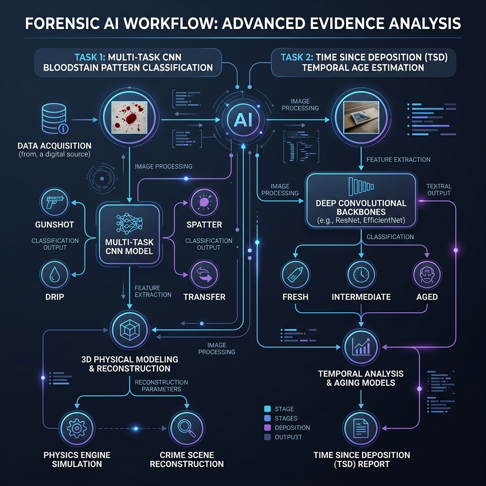

# Forensic Bloodstain Pattern Analysis (BPA) & Time Since Deposition (TSD) Estimation
**Toronto Metropolitan University — Major Research Project (MRP)**  
*Master of Data Science — Decision Support System*

---

## 🩸 Project Overview
This repository contains the complete decision support system developed for forensic bloodstain analysis. The project uses advanced deep learning backbones to solve two major forensic bottlenecks directly from crime scene imagery:
1. **Task 1: Pattern and Force Mechanism Classification**: Simultaneously classifies bloodstain patterns (excluding Cough Spatter to prevent leakage) and physical force velocities, integrated with a physics-based Area of Origin estimation tool.
2. **Task 2: Time Since Deposition (TSD) Age Estimation**: Estimates bloodstain age (categorized into Fresh, Intermediate, and Aged) by modeling temporal hemoglobin oxidation color shifts over a 28-day longitudinal drying cycle.

### 🎨 Forensic AI Workflow
Below is the complete architectural layout of the decision support pipeline:



---

## 📂 Codebase Directory Layout

```
MRP/
├── dashboard.py                  # Main Streamlit visual analytics application
├── requirements.txt              # Unified package dependencies list
├── .gitignore                    # Git dataset and environment exclusion config
├── SUBMISSION_GUIDE.md           # Reproduction and environment execution manual
├── COLAB_GUIDE.md                # Google Colab execution manual
├── BPA_Master_Colab_Notebook.ipynb # Master Colab notebook for GPU training/evaluations
├── assets/                       # UI assets and infographic diagram
│
├── Task_1_Classification/        # Task 1 Classification Engine
│   ├── Code/                     # Preprocessing, training, and evaluation scripts
│   ├── Evaluation/               # Metrics, ROC curves, Grad-CAM maps, and EDA plots
│   ├── Models/                   # Saved multi-task EfficientNet weights (.pth) & logs
│   ├── MD/                       # Sourcing & modeling guides (2 files)
│   └── Task_1_Development_History.md # Incremental model design logs
│
└── Task_2_TSD/                   # Task 2 Temporal Estimation Engine
    ├── Code/                     # bloodnet.py, ResNet training, TSD evaluations
    ├── Evaluation/               # TSD confusion matrices, ROC curves, drying plots
    ├── Models/                   # Saved ResNet-50 CBAM weights (.pth) & logs
    └── MD/                       # Sourcing & modeling guides (2 files)
```

---

## ⚡ Quick Start: Run the Interactive Dashboard
To immediately start the visual analytics dashboard on your local machine using the pre-trained weights included in this repository:

### 1. Recreate the environment
Make sure you have Python 3.10+ installed, then open your terminal inside the project root directory and run:
```bash
# Create a virtual environment
python -m venv mrp_env

# Activate the virtual environment
# On macOS/Linux:
source mrp_env/bin/activate
# On Windows:
mrp_env\Scripts\activate
```

### 2. Install requirements
```bash
pip install -r requirements.txt
```

### 3. Launch the Dashboard app
```bash
streamlit run dashboard.py
```
Open **[http://localhost:8501](http://localhost:8501)** in your web browser to interact with the dashboard.

---

## ☁️ Running on Google Colab (GPU Acceleration)
For model training and large-scale evaluations from scratch, we highly recommend using Google Colab's free T4 GPU framework:
1. Open the [BPA_Master_Colab_Notebook.ipynb](BPA_Master_Colab_Notebook.ipynb) in Colab.
2. Set Runtime hardware accelerator to **T4 GPU**.
3. Follow the detailed steps in [COLAB_GUIDE.md](COLAB_GUIDE.md) to upload and extract datasets via Google Drive.

---

## 🗄️ Dataset Sourcing & Citation
Due to size limitations (over 20 GB of raw scans and processed images), the raw datasets are excluded from Git commits. To train models from scratch, download datasets from the shared Drive link specified in [SUBMISSION_GUIDE.md](SUBMISSION_GUIDE.md):
- **Task 1 Pattern Classification:** Consolidates Zenodo, Mendeley Data, Kaggle, and HemoSpat repositories.
- **Task 2 TSD Temporal Estimation:** Sourced from the **BloodNet-Benchmark** Figshare repository containing ~50,000 rabbit temporal blood drop images.
